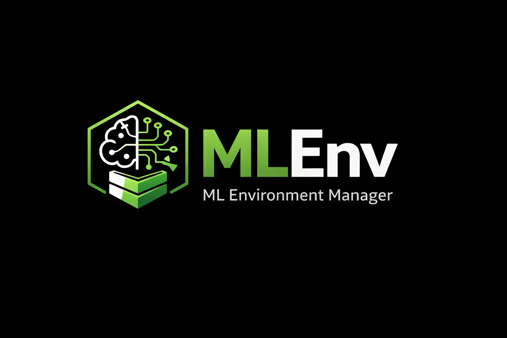

<p align="center">
  
</p>

<p align="center">
  
</p>

# MLEnv - ML Environment Manager


**Production-Grade GPU Container Management Platform**

MLEnv is a production-grade environment manager designed to eliminate setup complexity in machine learning and AI development. It provides safe, reproducible, GPU-ready development environments so engineers and researchers can focus on building, experimenting, and deploying AI systems — not debugging CUDA, drivers, or containers. If it runs in MLEnv, it can be trusted in production.

📖 **[Full Documentation](docs/index.md)** | 🚀 **[Getting Started](docs/guides/getting-started.md)** | 📦 **[Deployment Guide](docs/guides/deployment.md)**

---

## 🌟 What's New in v2.0.0

### Architecture & Quality
- **Hexagonal Architecture** - Modular, maintainable codebase with Ports & Adapters pattern
- **70+ Modular Files** - Professional code organization across core, adapters, and utilities
- **SQLite Backend** - Persistent state tracking with 9 tables + 2 views
- **25+ Automated Tests** - Unit, integration, and E2E test coverage
- **100% Backward Compatible** - All v1.x commands work seamlessly

### Intelligent Features
- **🛡️ Admission Control** - Prevents system crashes by checking resources before container creation
  - Memory usage < 85%, CPU < 90%, Available memory > 4GB
  - Protects your system from resource exhaustion
- **🤖 Auto GPU Detection** - `mlenv up --auto-gpu` intelligently selects free GPUs
- **📊 Resource Monitoring** - Real-time CPU, memory, GPU tracking with historical metrics
- **🏥 Health Checks** - Automatic container health monitoring with alerts

### Developer Experience
- **Project Templates** - Quick-start with `mlenv init --template pytorch|minimal`
- **Config File Support** - `~/.mlenvrc` for persistent defaults
- **NGC Catalog** - Browse and manage NVIDIA container images
- **Enhanced Commands** - `mlenv list`, improved `mlenv clean`, better `mlenv status`

### Enterprise Features
- **Linux Packages** - Production-ready DEB and RPM packages
- **Professional Installer** - Prerequisite checking, completions, uninstall support
- **CI/CD Integration** - GitHub Actions workflows for testing and releases
- **Comprehensive Docs** - 10+ guides covering installation to production deployment

See [**CHANGELOG.md**](.github/CHANGELOG.md) for complete release notes.

---

## ⚡ Quick Start

```bash
# Install
sudo ./install.sh

# Create a PyTorch project
mlenv init --template pytorch my-project
cd my-project

# Start with auto GPU detection
mlenv up --auto-gpu

# Enter container
mlenv exec

# Start Jupyter Lab
mlenv jupyter
```

**[→ Complete Getting Started Guide](docs/guides/getting-started.md)**

## 🎯 Key Features

### Core Capabilities
- ✅ **Zero-config GPU access** - Automatic NVIDIA GPU detection and passthrough
- ✅ **Smart GPU allocation** - Auto-detect free GPUs with `--auto-gpu`
- ✅ **VS Code Dev Containers** - Auto-generated `.devcontainer/devcontainer.json`
- ✅ **Smart Jupyter** - One-command Jupyter Lab with auto port forwarding
- ✅ **Requirements caching** - Hash-based caching prevents redundant installs
- ✅ **Persistent workspaces** - Code stays on host (bind-mounted)
- ✅ **Port forwarding** - Easy access to Jupyter, TensorBoard, APIs
- ✅ **User mapping** - Run as your user, not root (no permission issues)

### Safety & Monitoring
- 🛡️ **Admission control** - System crash prevention
- 📊 **Real-time monitoring** - CPU, memory, GPU utilization
- 🏥 **Health checks** - Container lifecycle tracking
- 📈 **Historical metrics** - Resource usage over time
- 🚨 **Project quotas** - Limit resources per project

### Developer Tools
- 🎨 **Project templates** - PyTorch, Minimal (more coming)
- ⚙️ **Config files** - `~/.mlenvrc` for defaults, project-level `.mlenvrc`
- 🐳 **NGC catalog** - Browse and search NVIDIA container images
- 🔍 **Enhanced status** - Container and GPU info at a glance
- 🧹 **Smart cleanup** - Interactive cleanup with `mlenv clean`

## 📋 Prerequisites

- **Docker** (version 20.10+)
- **sqlite3** (version 3.0+)
- **bash** (version 4.0+)
- **NVIDIA GPU** with compatible drivers (optional but recommended)
- **NVIDIA Container Toolkit** ([installation guide](https://github.com/NVIDIA/nvidia-container-toolkit))

**Verify your setup:**
```bash
docker --version
sqlite3 --version
nvidia-smi
docker run --rm --gpus all nvidia/cuda:12.0.0-base-ubuntu22.04 nvidia-smi
```

## 🔧 Installation

### Method 1: Install Script (Recommended)

```bash
# Clone repository
git clone https://github.com/amrit2356/mlenv.git
cd mlenv

# Run installer
sudo ./install.sh

# Verify installation
mlenv version
```

The installer will:
- ✅ Check Docker, SQLite, and NVIDIA Container Toolkit
- ✅ Install mlenv to `/usr/local/bin`
- ✅ Install shell completions (bash/zsh/fish)
- ✅ Initialize SQLite database
- ✅ Test GPU access

### Method 2: Package Managers

```bash
# Debian/Ubuntu
sudo dpkg -i mlenv_2.0.0_amd64.deb

# RHEL/CentOS/Fedora
sudo rpm -ivh mlenv-2.0.0-1.x86_64.rpm
```

### Method 3: Manual Installation

```bash
# Make executable
chmod +x bin/mlenv

# Copy to system directory
sudo cp bin/mlenv /usr/local/bin/

# Initialize database
mlenv init
```

### Installation Options

```bash
# Check prerequisites without installing
./install.sh --check

# Install to custom directory
./install.sh --install-dir ~/.local/bin

# Force reinstall
sudo ./install.sh --force

# Uninstall
sudo ./install.sh --uninstall
```

**[→ Complete Installation Guide](docs/guides/getting-started.md#installation)**

## 📚 Documentation

### Essential Guides
- 🚀 **[Getting Started](docs/guides/getting-started.md)** - Installation and first container
- 📖 **[User Guide](docs/guides/user-guide.md)** - Complete feature documentation
- 📦 **[Deployment Guide](docs/guides/deployment.md)** - Production deployment
- 🔄 **[Migration Guide](docs/guides/migration.md)** - Upgrading from v1.x

### Reference
- ⚙️ **[Configuration Reference](docs/reference/configuration.md)** - All config options
- 🎨 **[Template Reference](docs/reference/templates.md)** - Project template system
- 📋 **[CLI Reference](docs/reference/cli.md)** - All commands
- 🔍 **[Quick Reference](docs/reference/quickref.md)** - Cheat sheet

### Development
- 🏗️ **[Architecture Overview](docs/development/phase1-architecture.md)** - Hexagonal design
- 🛡️ **[Safety Systems](docs/development/phase2-safety.md)** - Admission control
- 🎨 **[Templates](docs/development/phase3-templates.md)** - Template engine
- 🧪 **[Testing Guide](docs/development/phase5-testing.md)** - Test framework

## 💻 Basic Usage

```bash
# Start a container with auto GPU detection
mlenv up --auto-gpu

# Or start with specific options
mlenv up --requirements requirements.txt --port 8888:8888 --gpu 0,1

# Enter interactive shell
mlenv exec

# Run a command
mlenv exec -c "python train.py"

# Start Jupyter Lab (auto-creates container if needed)
mlenv jupyter

# Check status
mlenv status

# List all containers
mlenv list

# Stop container
mlenv down

# Remove container
mlenv rm
```

**[→ Complete Usage Guide](docs/guides/user-guide.md)**

## 🛠️ Advanced Features

### Project Templates

```bash
# Create a PyTorch project
mlenv init --template pytorch my-dl-project

# Or a minimal project
mlenv init --template minimal my-experiment
```

### Config File

Create `~/.mlenvrc` for global defaults:
```bash
DEFAULT_IMAGE=nvcr.io/nvidia/pytorch:25.12-py3
DEFAULT_MEMORY=32g
DEFAULT_GPUS=all
AUTO_GPU=true
```

Or project-specific `.mlenvrc` in your project directory.

### NGC Catalog

```bash
# Search NGC catalog
mlenv catalog search pytorch

# Add image to favorites
mlenv catalog add nvcr.io/nvidia/pytorch:25.12-py3

# List catalog
mlenv catalog list
```

### Resource Monitoring

```bash
# Enhanced status with resource usage
mlenv status

# Output:
# Container: mlenv-myproject-abc123
# Status: running
# CPU: 45% | Memory: 12.5GB/32GB (39%)
# GPU 0: 78% util | 8.2GB/40GB
```

**[→ Advanced Usage Guide](docs/guides/user-guide.md#advanced-features)**

## 📦 Deployment

### Production Installation

```bash
# Using DEB package
wget https://github.com/amrit2356/mlenv/releases/download/v2.0.0/mlenv_2.0.0_amd64.deb
sudo dpkg -i mlenv_2.0.0_amd64.deb

# Using RPM package
wget https://github.com/amrit2356/mlenv/releases/download/v2.0.0/mlenv-2.0.0-1.x86_64.rpm
sudo rpm -ivh mlenv-2.0.0-1.x86_64.rpm
```

### Multi-User Setup

```bash
# Install system-wide
sudo ./install.sh

# Users can run without sudo
mlenv up --auto-gpu
```

### Resource Limits

```bash
# Set system-wide defaults in /etc/mlenv/mlenv.conf
MAX_MEMORY=64g
MAX_CPUS=16
ENABLE_ADMISSION_CONTROL=true
MEMORY_THRESHOLD=85
CPU_THRESHOLD=90
```

**[→ Complete Deployment Guide](docs/guides/deployment.md)**


## 🗺️ Roadmap

### v2.1 (Next Release)
- [ ] **Web Dashboard** - Monitor containers and GPUs via web UI
- [ ] **More Templates** - TensorFlow, Transformers, Stable Diffusion
- [ ] **Remote Development** - SSH server for remote access
- [ ] **Enhanced Monitoring** - Real-time graphs and alerts

### v2.2 (Planned)
- [ ] **Experiment Tracking** - Built-in W&B, MLflow integration
- [ ] **Multi-container** - Docker Compose-style orchestration
- [ ] **GPU Scheduling** - Queue and wait for GPU availability
- [ ] **Jupyter Extensions** - Auto-install popular extensions

### v3.0 (Future)
- [ ] **Cloud Integration** - Deploy to AWS, GCP, Azure
- [ ] **Team Features** - Shared resource pools, user quotas
- [ ] **Container Snapshots** - Save/restore container state
- [ ] **Central Management** - Multi-server dashboard

**Want a feature?** Open an [issue](https://github.com/amrit2356/mlenv/issues) or submit a PR!

## 🤝 Contributing

Contributions are welcome! We'd especially appreciate help with:
- **Templates** - Add templates for popular frameworks
- **Testing** - Expand test coverage
- **Documentation** - Examples for specific use cases
- **Windows WSL2** - Testing and improvements

See [Contributing Guide](docs/development/contributing.md) for details.

## 📄 License

MIT License - see [LICENSE](LICENSE) file for details

---

## 🙏 Acknowledgments

- Built on [NVIDIA NGC containers](https://catalog.ngc.nvidia.com/)
- Uses [NVIDIA Container Toolkit](https://github.com/NVIDIA/nvidia-container-toolkit)
- Inspired by Docker Compose and development container workflows

---

## 📞 Support

- **Issues**: [GitHub Issues](https://github.com/amrit2356/mlenv/issues)
- **Discussions**: [GitHub Discussions](https://github.com/amrit2356/mlenv/discussions)
- **Documentation**: [docs/](docs/index.md)

---

**Made with ❤️ for the ML/DL community**
